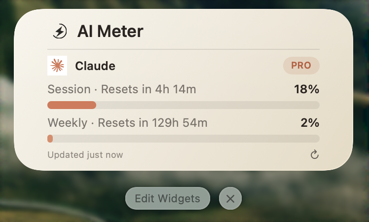
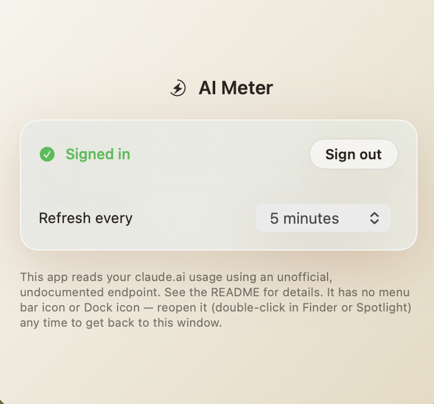

# AI Meter

AI Meter is a native macOS menu bar app and desktop widget that tracks your
**Claude.ai usage and session limits** — see how much of your Claude Pro or
Max session you've used and when it resets, right from your desktop,
without opening a browser tab. It's a **Claude usage tracker for macOS**
with no CLI, no installer, and no account beyond your existing claude.ai
login. Built to grow into other providers (Gemini, ChatGPT, ...) over time.

<!-- Screenshot: replace with an actual PNG at Docs/images/widget-menubar.png.
     Suggested content: the desktop widget (Medium or Large size) showing
     session % used and time-until-reset, on a normal macOS desktop. -->


## Disclosure — please read before using

Claude.ai doesn't publish an official API for your personal plan's
usage/limit numbers. This app gets them the same way several existing
open-source browser extensions do: by calling an **undocumented internal
endpoint** using your own logged-in session cookie (`sessionKey`) — the
same way claude.ai's own web app does after you sign in in a browser.

- This could stop working at any time if Anthropic changes that endpoint —
  there's no SLA or stability guarantee on it.
- Your session cookie is stored locally in the macOS Keychain, scoped to
  this app, and is only ever sent to `claude.ai` itself.
- Intended for personal, read-only use — checking your own account status,
  not sending messages or accessing anyone else's data.

Prefer something official? The
[Anthropic Usage & Cost / Rate Limits Admin API](https://platform.claude.com/docs/en/manage-claude/usage-cost-api)
covers API/organization billing usage (not personal Pro/Max limits) with an
Admin API key from an API organization.

## Install

1. Download `AI-Meter.zip` from the
   [latest release](https://github.com/terrykhm/ai-meter-mac-widget/releases/latest).
2. Double-click it in Finder to unzip, then drag `AI Meter.app` into
   Applications. (Dragging via Finder — rather than launching it in place
   from wherever it unzipped — avoids macOS's App Translocation, which can
   otherwise make the widget's registration disappear after a reboot.)
3. Open **AI Meter** from Applications and sign in with your claude.ai
   account, then add the widget: open Notification Center (or your
   desktop) → **Edit Widgets** → search "AI Meter" → add the Small,
   Medium, or Large size.

Every release is signed with a Developer ID certificate and notarized by
Apple, so it opens normally — no Gatekeeper warnings, no "unidentified
developer" dialogs, no developer account needed on your end.

<details>
<summary>Prefer Terminal?</summary>

```sh
curl -fsSL -o /tmp/AIMeter.zip https://github.com/terrykhm/ai-meter-mac-widget/releases/latest/download/AI-Meter.zip && \
ditto -x -k /tmp/AIMeter.zip /tmp/AIMeter-extracted && \
xattr -cr "/tmp/AIMeter-extracted/AI Meter.app" && \
rm -rf "/Applications/AI Meter.app" && \
mv "/tmp/AIMeter-extracted/AI Meter.app" /Applications/ && \
open "/Applications/AI Meter.app" && \
rm -rf /tmp/AIMeter-extracted /tmp/AIMeter.zip
```

This always grabs whatever the latest release is, so it doesn't go stale
as new versions ship.
</details>

<!-- Screenshot: replace with an actual PNG at Docs/images/sign-in-flow.png.
     Suggested content: the menu bar app's sign-in screen (or the
     "Enter session key manually" fallback) right after first launch. -->


Sign-in and the shared usage snapshot are per-machine — if you install on
more than one Mac, you'll sign in separately on each one.

## Troubleshooting

**Sign-in gets stuck / shows a Cloudflare challenge page.** Use "Enter
session key manually" on the sign-in screen instead: log into claude.ai in
your normal browser, open Web Inspector → Application → Cookies →
`https://claude.ai`, copy the `sessionKey` value, and paste it in.

**Widget shows stale data.** The widget only reads what the app last wrote;
it never fetches on its own. The app has no menu bar icon — reopen it
(double-click `AI Meter.app` again in Finder or Spotlight while it's
already running) to bring up Settings and trigger a refresh.

**"Sign in again" appears out of nowhere.** Your claude.ai session expired
or was invalidated (e.g. you signed out elsewhere). Reopen the app and sign
in again from Settings.

**Widget worked, then disappeared after a reboot.** The app was likely
launched via macOS's App Translocation instead of running from
/Applications. Quit it, delete it, and reinstall by dragging it into
/Applications from Finder rather than running it in place.

## Building from source

Requires Xcode, [XcodeGen](https://github.com/yonaskolb/XcodeGen)
(`brew install xcodegen`), and an Apple ID signed into Xcode — a free
Personal Team is enough for local builds, no paid Developer Program
membership needed.

```sh
xcodegen generate
open AIMeter.xcodeproj
```

Build and run the `AIMeterMenuBar` scheme. See
[CONTRIBUTING.md](CONTRIBUTING.md) for the full setup walkthrough (bundle
ID/Team ID configuration, capturing the real usage endpoint, cutting
notarized releases) and architecture notes.

## License

MIT — see [LICENSE](LICENSE).
